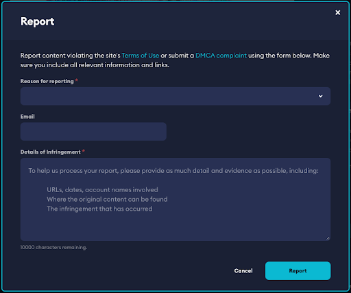
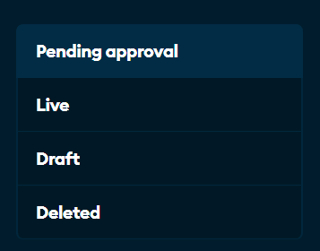
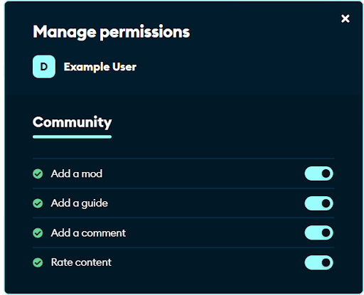
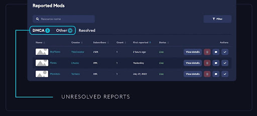

# Community Reports

mod.io provides built-in reporting tools, through [our website](https://mod.io/report) and the interface provided as a part of our Unity and Unreal Engine plugins, allowing users to report content that may be broken, is stolen, or violates our Terms of Use. We also provide endpoints in our [REST API](https://docs.mod.io/restapiref/#reports) and SDK, allowing reporting functionality to be integrated directly into custom engines, games, apps and websites.

Users can report mods, guides, and individual users. Reports for each of these are displayed under **Reports** in the **Game Admin** section of your game’s page.

:::warning
There is no setup to do for the reporting system, except to ensure that you integrate the reporting functionality anywhere you display UGC, and action reports submitted by users in a timely manner. This is a requirement enforced by mod.io and first-party platform holders. It is also best practice when dealing with UGC of any kind.
:::

## Moderation Flows

### Approving UGC

You can easily view and manage UGC for your game using the moderation dashboards available via the **Game Admin** menu. Here you will find a way to easily search, filter, and find all UGC, Guides and Users connected to your game, including content that is hidden, deleted, or still in draft form.

To review UGC that is currently pending approval click the **Moderation** button from the **Game Admin** screen. If you have not enabled per-platform moderation, you will see the following tabs:

Clicking any of these tabs will present a list of UGC ready for moderation.

|Tab      | Purpose                                        |
| ------------- |------------------------------------------------|
|Pending approval       | If Full Curation is enabled, all UGC ready for approval will appear here. Otherwise, only UGC that your moderators or automated mod.io checks have flagged, will be added to the queue for approval. From this tab you can **Approve UGC** for release. |
|Live  | All UGC that has been approved for consumption. From this tab you can **Deactivate UGC** which will move it back to the pending approval queue.  |
|Draft     | All UGC that doesn’t have a file and cannot be released.  |
|Deleted | All soft deleted UGC that have been removed from consumption by your moderators, mod.io staff or the content creator. Hard deleted UGC are permanently erased, and will not show up in this tab or anywhere else. From this tab you can **Restore UGC** which will make it live again, or you can **Permanently Delete** the UGC. |

:::tip
On all tabs you can edit the UGC’s details (such as name and description) by clicking the pencil icon. To delete a UGC, you can click the red trash can icon.
:::

### Approving Per-Platform Files

If you have enabled [per-platform moderation](/manual-curation/#Per-Platform Moderation), an additional tab **Pending files** will appear. If Per-Platform Moderation is enabled, all UGC with files ready for approval for the supported platforms will appear here. From this tab you can **Review Files** for approval, which will release the file onto the approved platform(s).

#### Reviewing Files
You can quickly download and review any uploaded files using the **Review Files** option, or by navigating to the **UGC Admin** dashboard from the UGC’s profile.

Every version of the UGC is listed here, in order of most recent to least. You can download that version of the UGC to test in your game by clicking the blue link in the file column.

The **Scan** option (magnifying glass) indicates the status of the virus and malware check on the file. The results are displayed by hovering your mouse cursor over the magnifying glass. 

:::note
Files are automatically scanned upon their upload to mod.io, and are deactivated (and a report opened) if they are suspected to contain a virus or malware.
:::

You can edit a file’s details by clicking the pencil icon. This includes the version number, changelog, and metadata blob. The metadata blob is a useful feature for game developers to include hidden arbitrary data such as the version of the game the mod is compatible with.

:::warning
Files cannot be tampered with once uploaded, so the only way to replace a UGC file with another, is to upload a new version with a new file, and set it live.
:::

If a UGC has multiple files/versions uploaded, you can choose which file/version to set live using the trophy icon, which instructs the SDKs to prioritize that file over the other versions. A non-live file can also be deleted using the trash can icon.

:::tip 
If Per-Platform Moderation is enabled, the same rules as above apply, however each file can be approved or denied for each of the platforms the game supports. If you are interested in using this feature, we recommend contacting us to provide a demonstration.
:::

### Editing UGC
To edit any of the UGC’s details, such as the name, description, and screenshots, you can click edit (pencil icon) from anywhere in your Moderation Dashboard. You can also access this menu via the UGC’s profile.

### Deleting UGC

By default, all UGC when deleted on mod.io is **Soft Deleted**, and can be restored by reversing the delete action. Deleting UGC moves it to the Deleted section in the Game Admin dashboard, which means it is no longer visible to any users except Team members.

:::danger
Deleting UGC also unsubscribes all users from the UGC which cannot be reversed, so be careful before deleting UGC even if it is only a soft delete.
:::

Once UGC is deleted, you are also presented with slightly different options:

**View reason** will display the date the UGC was deleted, the Team member (or the UGC creator) who deleted the UGC, and the reason(s) given by that Team member.

**Restore** will return the UGC to the Live section, and the UGC will again become visible to all users.

You can also edit the UGC’s details using the pencil icon, or permanently delete the UGC by clicking the red trash can icon.

:::danger
Once UGC is permanently deleted,  it cannot be restored!
:::

:::note
While the above sections have focused on UGC, the same flows apply when moderating guides submitted to mod.io.
:::

## User Management

Team Members have the ability to restrict and manage the user’s access to their game’s content that lives within mod.io. For example, this might be necessary if a user has repeatedly broken community guidelines or has violated the terms of service.

You’re able to selectively restrict a user from being able to perform the following actions:

* Add a mod
* Add a guide
* Add a comment
* Rate content

Depending on the user’s actions and their severity, you can select one, some, or all of these options to limit their interactions with other users and the UGC for your game.

:::note
In extreme cases, users can also be banned entirely - if you require a user to be banned, please contact us.
:::

To restrict a user, visit their profile page by clicking their display name anywhere it is displayed on the mod.io website. Once you are on their profile page, click **Manage permissions**.

You can then selectively enable or disable permitted functionality using the toggles that appear in the Manage permissions pop-up.

### Managing Restricted Users

You can view all restricted users for your game in the users section of the Game Admin menu. Here you can view the user’s country of origin, their join and last online date, the current status of their account (i.e. if they are live, awaiting email approval, or banned) as well as their currently set restriction level (fully or partially revoked).

You can also manage permissions to alter the current restriction level of that user. To contact the user, use the speech bubble icon. You may want to do this to warn them about their behaviour or to explain why their account has been restricted.

## Report Management

The process for managing reports submitted by the community is similar across UGC, guides, and users. The most common type of content to be reported is UGC, which will be the focus in this example.

The report queues are split into three sections, DMCA, Other, and Resolved. By default, the DMCA queue is displayed, as these are generally the highest priority reports that will require attention.

|Section      | Purpose                                        |
| ------------- |------------------------------------------------|
|DMCA      | DMCA, or Digital Millennium Copyright Act reports, are reports that have been filed by a third party copyright holder, alleging that the content is infringing on their intellectual property. These are usually filed by a third party organisation. |
|Other  | These reports are less urgent and are generated by community members. Reasons a mod may end up in the other queue include broken mods, rude or offensive content, or anything else that may contravene our Terms of Service. Your game moderators will be responsible for actioning these reports, with assistance from mod.io as negotiated or required. |
|Resolved     | This is an historical record of reports that have been previously dealt with by a team member, from both the DMCA and Other queues.  |
|Deleted | All soft deleted UGC that have been removed from consumption by your moderators, mod.io staff or the content creator. Hard deleted UGC are permanently erased, and will not show up in this tab or anywhere else. From this tab you can **Restore UGC** which will make it live again, or you can **Permanently Delete** the UGC. |

:::note
The mod.io team will action valid DMCA’s, unless your team actions them sooner.
:::

Reports are shown in a table view. Each piece of reported content is shown only once. If multiple users have reported the same piece of content, you will be able to see the number of reports in the count column.

You are able to view more details, including the reasons for the report, and each individual report by clicking the View details button. The speech bubble icon here allows you to contact the creator of the piece of content for which the reports have been filed, and the checkmark will mark the report(s) as resolved.

If a piece of content violates terms and conditions, using the red trash icon will delete that content and close all associated reports.
